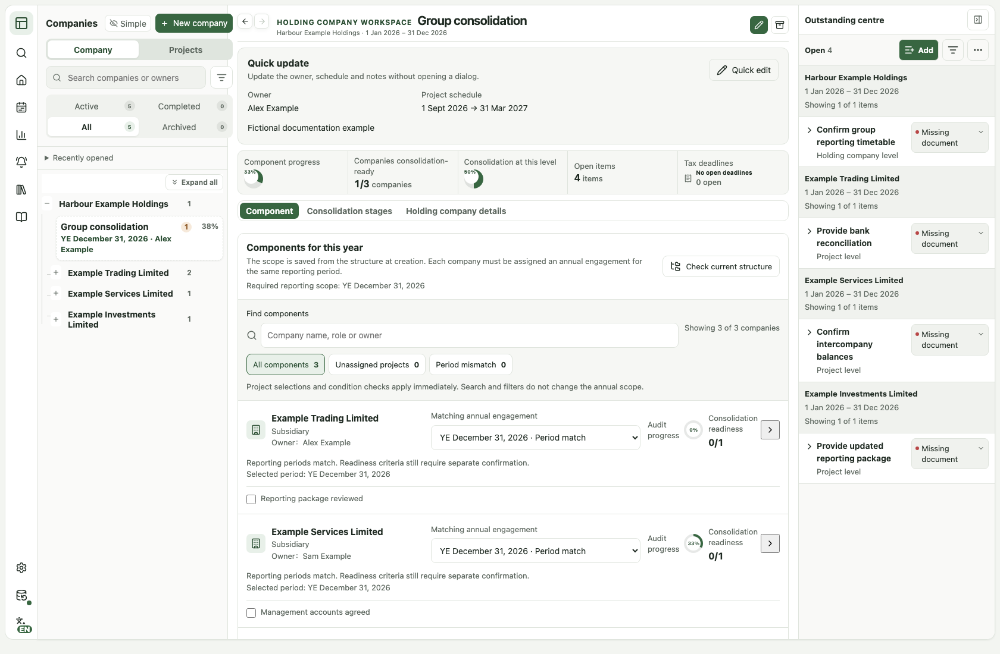

<div align="center">

# APW
### Audit Project Workbench

**Clarity across companies, years and group engagements.**

A local-first audit coordination workbench for practitioners and small-practice leads.

**Desktop-first** · **Local-first** · **English / 简体 / 繁體**

[Open the web workbench](https://finnlyu41-tech.github.io/audit-project-workbench/) · [中文介绍](README.zh-CN.md) · [Documentation](#documentation) · [License](#license)

</div>

---

**Know what is moving, what is missing, and what needs your attention.** APW brings company masters, reporting periods, group components, outstanding items and deadlines into one workspace—alongside your existing working papers, not in place of them.

> **Evaluation & licensing:** Private non-production evaluation is available under the [license](LICENSE). Production or commercial use of covered new material requires separate written permission. Earlier MIT and third-party rights are preserved.

[](docs/images/workspace-en.png)

*Actual APW interface with fictional demonstration data. Open the image for a closer look.*

## Why APW

### Companies stay. Engagements change.

Keep each legal entity as a long-lived company master. Organise independent annual engagements—or several reporting years delivered together—without confusing reporting periods with the dates you perform the work.

### A group's history is more than its current structure.

Each holding-company engagement keeps its own component scope. Link the correct annual projects, spot reporting-period mismatches, and track component readiness separately from the current level's consolidation work. Later changes to the company hierarchy do not silently rewrite a saved annual scope.

### Your workbench, on your device.

The current application has no business-data backend. Start in a desktop browser, retain your existing working-paper environment, and keep versioned workbench backups under your control. An optional linked local file complements browser storage; it is not a cloud-sync or collaboration service.

## From overview to next action

| In the workbench | What you can do |
|---|---|
| **Priority actions** | Open the specific project, outstanding item or deadline that needs attention. |
| **Company & year navigation** | Search companies and engagements, revisit recent work, and move between reporting periods. |
| **Group workspace** | Inspect saved components, period matches, readiness conditions and source-linked outstanding items. |
| **Outstanding centre** | Record items consecutively, filter the list, and update each item's own status. |
| **Client follow-up drafts** | Select items from one company and engagement, review the text, then copy or download it. Nothing is sent automatically. |
| **Schedules & tax deadlines** | See execution dates and company-level tax obligations together without treating them as the same thing. |
| **Reusable templates** | Start from a template or prior-year structure without carrying forward completed work. Preview template-package imports before applying them. |
| **Management reports** | Filter the portfolio, one company or a group, then print the scoped report to PDF. |

[Explore the detailed feature reference →](docs/features.md)

## Built around audit work—not just task lists

**Outstanding cleared ≠ audit work completed ≠ component ready for consolidation.**

APW keeps these states distinct. A completed project does not automatically clear a company's remaining tax obligations. Professional judgement, evidence assessment, review and sign-off remain with qualified people.

### A practical example

A holding company has three components, with work performed by your team, another auditor and management. APW lets you see which annual project is linked to each component, what remains outstanding, and which readiness conditions still need confirmation—without changing your working-paper system.

The saved annual scope stays separate from the group's current company hierarchy. It is a coordination record, not an immutable audit file or an automatic financial-consolidation engine.

## Start with one engagement

1. **Create a company master.** Record the entity and fiscal-year default; enable holding-company structure only when needed.
2. **Add an engagement.** Set the reporting period or periods, choose an empty start, a template or a prior-year structure, and set the owner and schedule.
3. **Work from the next action.** Update milestones, record outstanding items and prepare a reviewed follow-up draft when appropriate.

Open the in-app **Guide** for step-by-step instructions. For an initial evaluation, use fictional records and practise exporting and restoring a backup before relying on the workbench.

## Data you control. Boundaries you can understand.

- **Local business data.** Records live in browser `localStorage` and, when explicitly enabled, a linked `.apw.json` file. The app has no backend receiving engagement data; ordinary page-hosting traffic still applies.
- **Explicit recovery.** Versioned JSON backups, startup checks, visible save-failure warnings and conflict handling support recovery. Backups may contain confidential information and do not include unsubmitted form drafts.
- **One active editing window.** Updated windows coordinate within the same browser storage context. This is not cross-device, cross-profile or multi-user synchronisation.

Local-first does not mean automatically encrypted, immune to data loss, or a replacement for your backup policy. Keep independent backups; do not clear browser storage to update the app. See [privacy](docs/privacy.md), [recovery](docs/stability-recovery.md) and [window safety](docs/workspace-window-safety.md).

## Focused by design

APW is designed for individual practitioners and small-practice leads coordinating work across companies and years. It is not a full working-paper repository, accounting ledger, filing engine, client portal or multi-user practice-management platform. Native mobile apps, team sync and role-based permissions are not implied by the web workbench.

The product direction is **reliability → less repeated work → useful work output**. Future capabilities are described separately in the [roadmap](ROADMAP.md), not presented as shipping features.

## Documentation

| Start here | Go deeper |
|---|---|
| [中文介绍](README.zh-CN.md) | [Architecture & data model](docs/architecture.md) |
| [Detailed features](docs/features.md) | [Privacy & data boundaries](docs/privacy.md) |
| [Continuous entry & follow-up drafts](docs/client-follow-up.md) | [Recovery & stability](docs/stability-recovery.md) |
| [Lightweight outstanding centre](docs/outstanding-light.md) | [Single-window editing](docs/workspace-window-safety.md) |
| [Roadmap](ROADMAP.md) | [Release verification](docs/release-checklist.md) |
| [Changelog](CHANGELOG.md) | [License & commercial-use boundaries](docs/licensing.md) |

<details>
<summary><strong>Developer setup and verification</strong></summary>

For the rights holder, authorised developers, or private non-production evaluation permitted by the license. Requires Node.js 20.19+ and the pnpm version pinned in `package.json`.

```bash
corepack enable
pnpm install --frozen-lockfile
pnpm exec playwright install chromium webkit
pnpm dev
```

Before proposing or publishing changes:

```bash
pnpm check
```

The check runs unit tests, the configured browser regression suites and a production build. See the [release checklist](docs/release-checklist.md) for scope and manual checks; passing tests do not certify every browser or device.

</details>

## License

New covered material is distributed under **[APW Proprietary License 1.0](LICENSE)**. This is a source-visible proprietary project, not an open-source grant for new additions. Production or commercial use of covered material requires separate written authorisation, except where earlier or independent rights already permit it.

Previously MIT-licensed material retains its original rights. See the [licensing transition](docs/licensing.md), [historical MIT notice](licenses/MIT-legacy.txt) and [third-party notices](THIRD_PARTY_NOTICES.md). Your records, backups and user-authored outputs do not become APW's property.

## Feedback & contributions

Found a workflow problem? [Open an issue](https://github.com/finnlyu41-tech/audit-project-workbench/issues) with a reproducible example using fictional data. Follow the [contribution guide](CONTRIBUTING.md) before submitting code and the [security policy](SECURITY.md) for security reports. Never post real client records, backups or credentials publicly.

---

<div align="center">

**Keep the company clear. Keep the year clear. Keep the next action clear.**

[Open APW](https://finnlyu41-tech.github.io/audit-project-workbench/) · [中文介绍](README.zh-CN.md)

</div>
