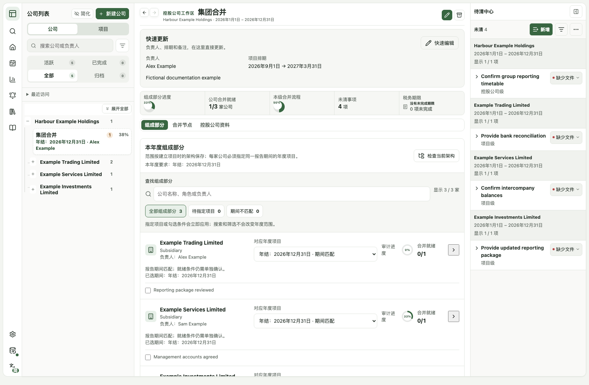

# APW
### Audit Project Workbench · 审计项目工作台

**看清每家公司、每个年度、每个集团项目。**

面向独立执业者与小型审计事务所负责人的本地优先工作台。

**桌面优先** · **数据本地保存** · **English / 简体 / 繁體**

[打开在线工作台](https://finnlyu41-tech.github.io/audit-project-workbench/) · [English](README.md) · [功能详解](docs/features.md) · [授权说明](docs/licensing.md)

---

**哪些工作在推进，哪些资料还欠着，下一步该处理什么。** APW 将公司主档、报告期间、集团组成部分、待清事项和期限放进同一个工作区，让你保留原有底稿环境，也能统筹项目进展。

> **评估与授权：** [许可证](LICENSE)允许私人非生产评估。新许可覆盖内容的生产或商业使用需要另行书面授权；历史 MIT 内容及第三方的既有权利保留。

*真实应用界面，全部为虚构演示资料；点击图片可查看大图。*

## 不只是任务清单，而是懂公司与年度的工作台

### 公司长期保留，年度工作各自清楚

公司主档与年度项目分开管理。可以逐年建立独立项目，也可以把共同执行的多个报告年度放在一个项目中，同时保留各个完整报告期间。**报告覆盖哪一年，与工作在哪一天执行，不再混在一起。**

### 管理的是某一年度的集团，不只是今天的公司树

每个控股公司年度项目保留自己的组成部分范围，明确关联下属项目，并提示报告期间不匹配。组成部分进度、合并就绪条件、本级合并流程和待清事项分别显示；后续调整当前公司架构，不会自动改写已保存的年度范围。

### 工作资料，由你直接掌握

当前核心应用没有接收业务资料的后端。在桌面浏览器中打开，就可以评估工作台；不要求先把底稿和客户文件迁进新平台。浏览器保存、可选关联本地文件及版本化备份各有明确边界，**不是云同步或多人协作服务。**

## 从看见问题，到直接处理

| 工作区 | 可以完成什么 |
|---|---|
| **首页优先事项** | 直接进入需要处理的项目、待清事项或期限。 |
| **公司与年度导航** | 查找公司和项目，切换报告期间，返回最近处理的工作。 |
| **集团工作台** | 查看年度组成部分、期间匹配、就绪条件及带来源的待清汇总。 |
| **轻量待清中心** | 连续录入、筛选和更新事项；按需展开说明，不把待清当作审计完成条件。 |
| **客户跟进草稿** | 选定单一公司与年度的事项，检查文字后复制或下载；不自动发送。 |
| **项目排期与税务期限** | 统一查看执行日期和公司税务义务，同时保留两者各自的含义。 |
| **可复用范本** | 从范本或上一年度结构建立新项目，不带入旧完成勾选；范本包导入先预览再确认。 |
| **管理层报告** | 按项目组合、公司或集团查看进展与风险，并将当前范围打印为 PDF。 |

[查看完整功能说明 →](docs/features.md)

## 专业边界，始终分清

**待清已解决 ≠ 审计程序完成 ≠ 组成部分具备合并条件。**

项目完成后，公司的未结束税务义务仍可继续提醒。软件负责整理状态，审计判断、证据评估、复核和签署仍由具备相应资格的人负责。

例如，一个集团的三家成员分别由本团队、其他审计师及管理账提供资料，你可以查看每家关联的年度项目、未清事项和待确认的就绪条件，而不必更换底稿系统。这里的年度范围快照是工作协调记录，**不是不可篡改的审计档案，也不是自动编制合并财务报表的引擎。**

## 从一个项目开始

1. **建立公司主档。** 填写公司与会计年度默认值，需要时才启用控股公司结构。
2. **建立年度项目。** 确认报告期间，选择空白、范本或上一年度结构，再填写负责人和排期。
3. **处理下一步。** 更新里程碑，录入待清事项，并在需要时生成经过人工检查的客户跟进草稿。

详细步骤在应用左侧的 **使用指南** 中。首次评估建议使用虚构资料，并先演练一次备份导出与恢复。

## 资料可带走，保存边界看得懂

- **本机业务资料：** 保存在浏览器 `localStorage`，也可主动关联 `.apw.json` 本地文件。核心应用不向业务后端发送项目资料；网页加载仍有正常浏览器和托管流量。
- **明确的恢复路径：** 提供版本化 JSON 备份、启动校验、保存失败警告与冲突处理。备份可能包含机密资料，且不包含尚未提交的表单草稿。
- **单窗口编辑保护：** 新版窗口在同一浏览器存储环境中协调编辑权，不等于跨设备、跨浏览器或多人同步。

本地保存不代表自动加密、不会丢失或不需要备份。请保留独立备份，**不要为了更新而清除浏览器资料**。参阅 [隐私与资料边界](docs/privacy.md)、[恢复机制](docs/stability-recovery.md) 和 [窗口保护](docs/workspace-window-safety.md)。

## 保持专注，而不是包办一切

APW 适合统筹多个公司、报告年度和集团工作的个人使用者与事务所负责人。目前不是完整底稿库、会计总账、申报引擎、客户门户或多人事务所平台；在线工作台不意味着已经提供手机 App、团队同步和角色权限。

推进顺序是 **先可靠 → 再减少重复操作 → 让记录直接用于工作**。后续方向见 [路线图](ROADMAP.md)，不将规划中的能力描述为现成功能。

## 文档导航

| 使用与功能 | 技术与边界 |
|---|---|
| [完整功能说明](docs/features.md) | [架构与数据模型](docs/architecture.md) |
| [连续录入与跟进草稿](docs/client-follow-up.md) | [隐私说明](docs/privacy.md) |
| [轻量待清中心](docs/outstanding-light.md) | [恢复与稳定性](docs/stability-recovery.md) |
| [路线图](ROADMAP.md) | [发布检查](docs/release-checklist.md) |
| [更新记录](CHANGELOG.md) | [授权说明](docs/licensing.md) |

开发环境和验证命令见 [英文首页的开发说明](README.md#documentation)。开发或修改权限以许可证和你的书面授权为准。

## 软件授权

首次以新许可发布的原创新增内容采用 **[APW Proprietary License 1.0](LICENSE)**。这是源码可见的专有许可，不是对后续新增内容的开源授权。新许可覆盖内容的生产或商业使用须另行书面授权；已有独立权利允许的情况除外。

历史 MIT 内容继续保留原有权利，第三方组件遵守各自许可。详见 [切换边界](docs/licensing.md)、[历史 MIT 声明](licenses/MIT-legacy.txt) 和 [第三方声明](THIRD_PARTY_NOTICES.md)。用户资料、备份及自行编写的内容不会因为使用 APW 而变成开发者的财产。

## 反馈与贡献

欢迎用虚构资料提供可复现的 [问题反馈](https://github.com/finnlyu41-tech/audit-project-workbench/issues)。提交代码前先阅读 [贡献指南](CONTRIBUTING.md)；安全问题按 [安全政策](SECURITY.md) 报告。请勿公开上传真实客户名称、备份、凭据或机密截图。

---

**公司清楚，年度清楚，下一步清楚。**

[打开 APW](https://finnlyu41-tech.github.io/audit-project-workbench/) · [English](README.md)

